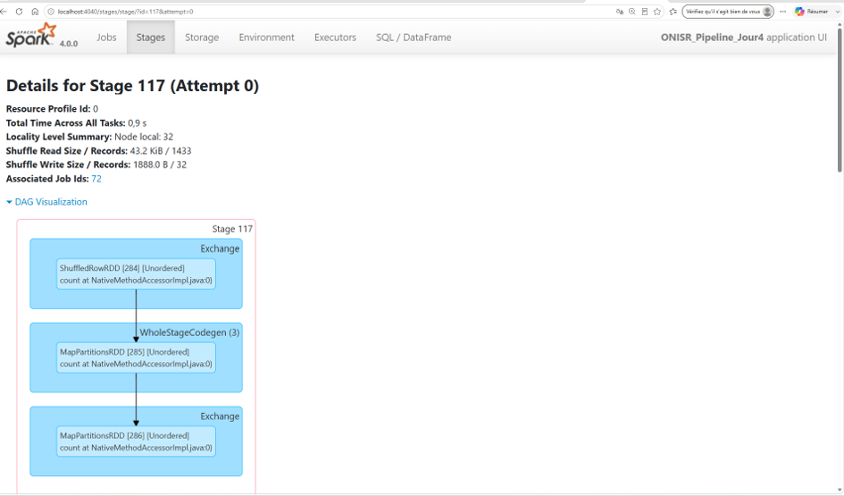
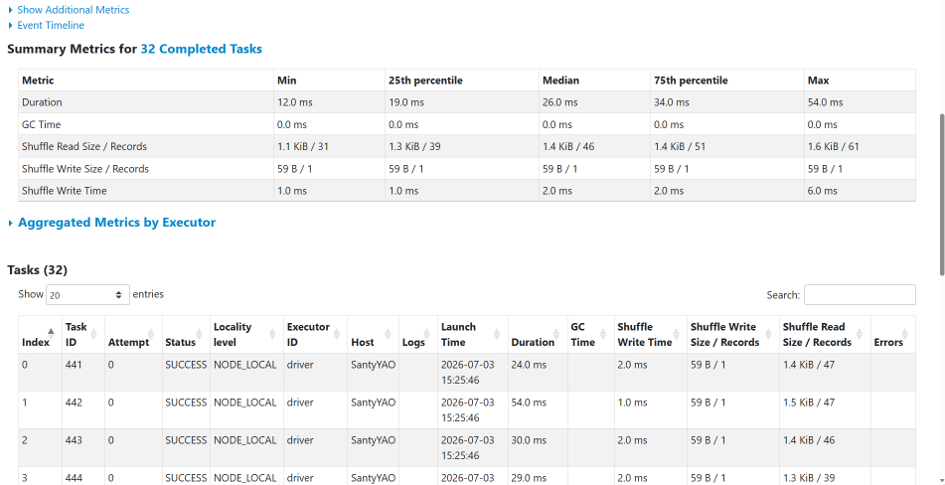
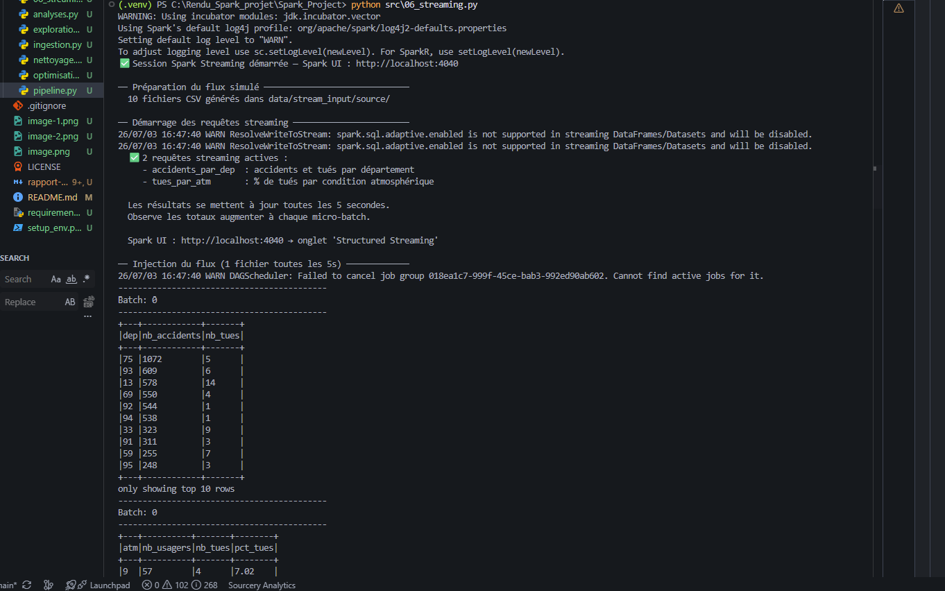
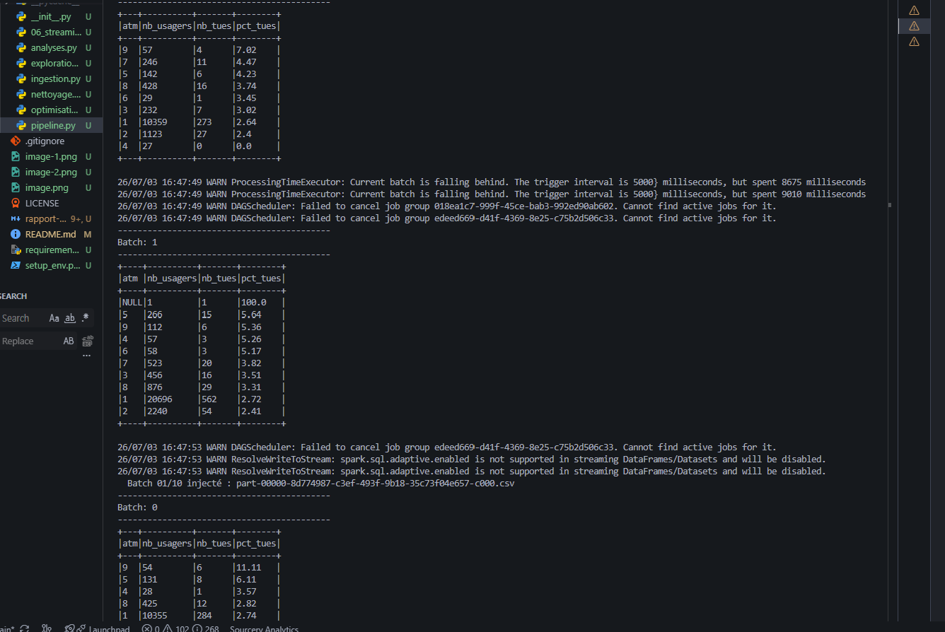
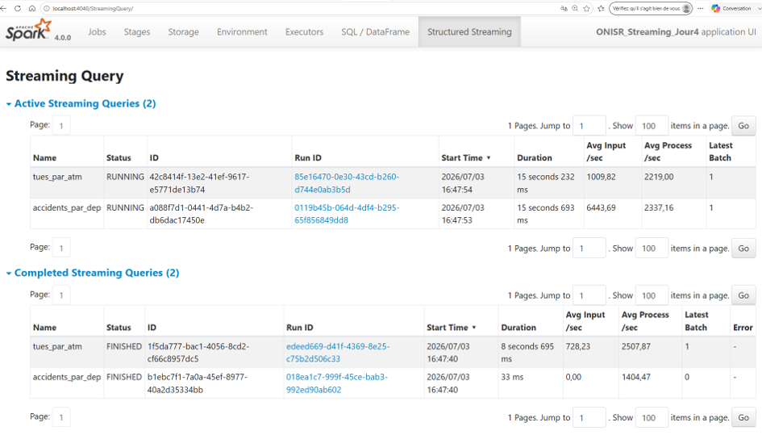

# Rapport de projet - Pipeline Spark (Jour 4)

- **Équipe** : Audrey MOBOU, Sandrine YAO, Destiné BEHANZIN
- **Jeu de données** : Accidents corporels ONISR 2022 (Option A)
- **Date** : 03/07/2026

---

## 1. Jeu de données et schéma cible

**Source et volume :**
Données ouvertes ONISR (data.gouv.fr) — accidents corporels de la circulation 2022.
4 fichiers CSV, séparateur point-virgule, encodage iso-8859-1.

| Fichier | Lignes | Rôle |
|---|---|---|
| caracteristiques.csv | 55 302 | 1 ligne = 1 accident (heure, météo, département) |
| lieux.csv | 55 302 | 1 ligne = 1 accident (type de route, surface, vitesse max) |
| vehicules.csv | 94 493 | 1 ligne = 1 véhicule impliqué |
| usagers.csv | 126 662 | 1 ligne = 1 personne impliquée (gravité, âge, sexe) |

Clé de jointure commune : `Num_Acc` (nommée `Accident_Id` dans caracteristiques.csv, renommée après lecture).

**Schéma cible (colonnes principales retenues) :**

| Colonne | Type | Source | Description |
|---|---|---|---|
| Num_Acc | LongType | toutes | Identifiant unique de l'accident |
| jour / mois / an | IntegerType | caracteristiques | Date de l'accident |
| heure | IntegerType | caracteristiques | Heure dérivée de hrmn |
| date_accident | DateType | caracteristiques | Date construite (yyyy-MM-dd) |
| dep | StringType | caracteristiques | Département (ex: "13", "2A") |
| atm | IntegerType | caracteristiques | Condition atmosphérique (1=normale … 9=autre) |
| catr | IntegerType | lieux | Catégorie de route (1=autoroute … 4=communale) |
| surf | IntegerType | lieux | État de la surface (1=normale, 2=mouillée …) |
| vma | IntegerType | lieux | Vitesse maximale autorisée |
| grav | IntegerType | usagers | Gravité (1=indemne, 2=tué, 3=blessé hosp., 4=blessé léger) |
| catv | IntegerType | vehicules | Catégorie de véhicule |

**Questions métier visées :**
1. Les conditions météorologiques influencent-elles la gravité des accidents ?
2. Quel type de route concentre le plus de tués ?
3. Quels sont les départements les plus accidentogènes en nombre de tués ?

---

## 2. Pipeline (bronze -> silver -> gold)

```
brut (bronze)  ->  nettoyé (silver, Parquet)  ->  agrégé (gold, résultats)
                                                ->  exploration (AQE)  ->  rapport
```

**Nettoyage appliqué :**

| Table | Opération | Raison |
|---|---|---|
| caracteristiques | Extraction heure depuis `hrmn` ("HH:MM") | Colonne dérivée utile pour analyses temporelles |
| caracteristiques | Filtre heure entre 0 et 23 | Écarter les heures aberrantes |
| caracteristiques | Filtre `Num_Acc` non null | Clé de jointure obligatoire |
| caracteristiques | Construction `date_accident` (yyyy-MM-dd) | Date exploitable pour analyses |
| caracteristiques | Conversion lat/long (virgule → point) | Format français non reconnu par FloatType |
| caracteristiques | `dropDuplicates(["Num_Acc"])` | 1 accident = 1 ligne |
| usagers | Filtre `grav` dans (1,2,3,4) | Écarter gravité non renseignée (code 0) |
| usagers | `dropDuplicates()` | Supprimer doublons complets |
| lieux / vehicules | Filtre `Num_Acc` non null | Intégrité référentielle |

**Volumétrie :**

| Table | Lignes brutes | Après nettoyage | Écartées |
|---|---|---|---|
| caracteristiques | 55 302 | 55 302 | 0 (0.0%) |
| usagers | 126 662 | 126 421 | 241 (0.19%) |
| lieux | 55 302 | 55 302 | 0 (0.0%) |
| vehicules | 94 493 | 94 493 | 0 (0.0%) |

**Partitionnement de la silver :**
La table `caracteristiques` est partitionnée par `dep` (département).
Raison : faible cardinalité (~100 valeurs), filtre fréquent dans les analyses géographiques,
et permet le partition pruning lors de requêtes sur un département précis.

---

## 3. Analyses

### Analyse 1 — Agrégation : gravité par condition atmosphérique

**Question :** Les conditions météorologiques dégradées augmentent-elles le risque de décès ?

**Code clé :**
```python
df_analyse1 = (
    silver_carac.select("Num_Acc", "atm")
    .join(silver_usag.select("Num_Acc", "grav"), on="Num_Acc", how="inner")
    .groupBy("atm")
    .agg(
        F.count("*").alias("nb_usagers"),
        F.sum(F.when(F.col("grav") == 2, 1).otherwise(0)).alias("nb_tues"),
        F.round(
            F.sum(F.when(F.col("grav") == 2, 1).otherwise(0)) /
            F.when(F.count("*") > 0, F.count("*")).otherwise(None) * 100, 2
        ).alias("pct_tues")
    )
    .orderBy(F.col("pct_tues").desc())
)
```

**Résultat :**
```
+----+----------+-------+--------+
| atm|nb_usagers|nb_tues|pct_tues|
+----+----------+-------+--------+
|   5|      1249|     74|    5.92|   ← Brouillard/Fumée
|   9|       534|     29|    5.43|   ← Autre
|   4|       315|     13|    4.13|   ← Neige/Grêle
|   7|      2648|    101|    3.81|   ← Temps éblouissant
|   8|      4263|    159|    3.73|   ← Temps couvert
|   6|       272|     10|    3.68|   ← Vent fort
|   3|      2309|     75|    3.25|   ← Pluie forte
|   1|    103759|   2805|     2.7|   ← Normale
|   2|     11071|    283|    2.56|   ← Pluie légère
+----+----------+-------+--------+
```

**Lecture métier :**
Le brouillard est la condition la plus mortelle avec 5.92% de tués, soit plus du double du taux
par temps normal (2.7%). Contre-intuitivement, la pluie légère a le taux le plus bas (2.56%) :
les conducteurs adoptent probablement une conduite plus prudente par temps de pluie visible,
contrairement au brouillard qui réduit la visibilité sans signal d'alerte aussi immédiat.
Le temps éblouissant (atm=7, 3.81%) mérite attention malgré son apparence anodine.

---

### Analyse 2 — Jointure : profil des accidents par type de route

**Question :** Quel type de route concentre le plus de tués, et dans quelles conditions de surface ?

**Code clé :**
```python
df_lieux_b = F.broadcast(silver_lieux.select("Num_Acc", "catr", "surf", "vma"))

df_analyse2 = (
    silver_carac.select("Num_Acc", "atm", "col", "dep")
    .join(df_lieux_b, on="Num_Acc", how="inner")
    .join(silver_usag.select("Num_Acc", "grav"), on="Num_Acc", how="inner")
    .groupBy("catr")
    .agg(
        F.count("*").alias("nb_usagers"),
        F.round(F.avg("vma"), 1).alias("vitesse_max_moy"),
        F.sum(F.when(F.col("grav") == 2, 1).otherwise(0)).alias("nb_tues"),
        F.round(F.avg(F.when(F.col("surf") == 2, 1).otherwise(0)) * 100, 2).alias("pct_route_mouillee")
    )
    .orderBy(F.col("nb_tues").desc())
)
```

**Résultat :**
```
+----+----------+---------------+-------+------------------+
|catr|nb_usagers|vitesse_max_moy|nb_tues|pct_route_mouillee|
+----+----------+---------------+-------+------------------+
|   3|     47188|           63.7|   2001|             15.73|  ← Départementale
|   4|     49153|           45.1|    664|             14.17|  ← Communale
|   2|      9257|           76.5|    409|             16.33|  ← Nationale
|   1|     14473|          100.9|    299|             16.19|  ← Autoroute
|   7|      4905|           56.5|    121|             13.78|  ← Voie rapide urbaine
+----+----------+---------------+-------+------------------+
```

**Lecture métier :**
Les routes départementales (catr=3) concentrent à elles seules 2001 tués sur 3550 au total,
soit 56% des décès, alors qu'elles affichent une vitesse max moyenne de seulement 63.7 km/h.
C'est le croisement entre vitesse réelle pratiquée, absence de séparateur central, et
infrastructure moins sécurisée que l'autoroute qui explique ce résultat.
Les autoroutes (catr=1, vma moy. 100.9 km/h) ne génèrent que 299 tués malgré leurs vitesses
élevées, preuve de l'efficacité des infrastructures à chaussées séparées.

---

### Analyse 3 — Window function : classement des départements

**Question :** Quels départements concentrent le plus de tués, et quelle part du total national représentent-ils ?

**Code clé :**
```python
w_tues = Window.orderBy(F.col("nb_tues").desc())

df_analyse3 = (
    df_dep
    .withColumn("rang_tues", F.rank().over(w_tues))
    .withColumn("pct_cumul_tues", F.round(
        F.sum("nb_tues").over(w_tues.rowsBetween(Window.unboundedPreceding, Window.currentRow))
        / F.sum("nb_tues").over(Window.partitionBy()) * 100, 2
    ))
    .orderBy("rang_tues")
)
```

**Résultat (top 10) :**
```
+---+----------+-------+---------------+---------+--------------+
|dep|nb_usagers|nb_tues|nb_blesses_hosp|rang_tues|pct_cumul_tues|
+---+----------+-------+---------------+---------+--------------+
| 13|      5597|    117|            729|        1|          3.30|
| 59|      2614|     97|            458|        2|          6.03|
| 33|      3122|     87|            455|        3|          8.48|
| 76|      1669|     74|            318|        4|         10.56|
| 62|      1166|     73|            337|        5|         12.62|
|988|       673|     70|            154|        6|         14.59|
| 83|      1996|     64|            457|        7|         16.39|
| 44|      1108|     63|            292|        8|         18.17|
| 69|      5140|     61|            463|        9|         19.89|
| 34|      1335|     60|            370|       10|         21.58|
+---+----------+-------+---------------+---------+--------------+
```

**Lecture métier :**
Les Bouches-du-Rhône (13) arrivent en tête avec 117 tués. Les 10 premiers départements
cumulent déjà 21.58% de tous les tués nationaux, sur 96 départements métropolitains.
Le département 988 (Polynésie française) en 6e position avec 70 tués pour seulement
673 usagers impliqués révèle un taux de mortalité particulièrement élevé (10.4%),
probablement lié à l'infrastructure routière et à l'éloignement des secours.

---

## 4. Optimisation

**Optimisation choisie :** Broadcast Join

**Pourquoi :**
La table `lieux` contient exactement autant de lignes que `caracteristiques` (55 302),
soit 1 ligne par accident. Elle est plus petite que `usagers` (126 662 lignes) et peut
tenir en mémoire sur le driver. Le broadcast évite le shuffle réseau que Spark effectuerait
par défaut avec un SortMergeJoin.

**Mesure avant/après :**
```
Sans broadcast : 0.97s   (SortMergeJoin → shuffle des deux côtés)
Avec broadcast : 0.91s   (BroadcastHashJoin → shuffle d'un seul côté)
Gain           : 6.2%
```

**Extrait du plan d'exécution (explain) :**
```
== Physical Plan ==
AdaptiveSparkPlan isFinalPlan=false
+- BroadcastHashJoin [Num_Acc], [Num_Acc], Inner, BuildRight, false
   :- FileScan parquet [Num_Acc, dep]   ← côté gauche : scan normal
   +- BroadcastExchange HashedRelationBroadcastMode  ← côté droit : diffusé
      +- FileScan parquet [Num_Acc, catr]
```

**Ce que ça change :**
Le plan confirme `BroadcastHashJoin` avec `BroadcastExchange` côté droit (lieux).
Le gain est modeste (6.2%) car le volume est faible en mode local.
Sur un cluster avec des millions de lignes, le broadcast élimine un shuffle coûteux
(transfert réseau entre nœuds) et peut réduire le temps de plusieurs dizaines de pourcents.

---

## 5. Lecture de la Spark UI

**Job observé :** Analyse 3 — window function sur le classement des départements

**Où se produit le shuffle (Exchange) :**
Deux shuffles sont présents dans ce job :
1. Après le `groupBy("dep")` — regroupement des lignes par département
2. Après le `Window.orderBy(nb_tues.desc())` — tri global pour le classement

Le warning `No Partition Defined for Window operation` indique que Spark a déplacé
toutes les données vers une seule partition pour calculer le rang global.
C'est attendu pour un classement mondial (pas de `partitionBy` dans la window) —
sur notre volume de ~100 départements, c'est acceptable.

**Nombre de stages et de tasks :**
- Job Analyse 3 : 3 stages
- Stage 1 : lecture Parquet + join (2 tasks)
- Stage 2 : groupBy dep (8 tasks — shuffle.partitions=8)
- Stage 3 : window rank + sort (1 task — données ramenées en 1 partition)







**Captures :** [insérer captures Spark UI — http://localhost:4041]

**Commentaire :**
Le DAG montre clairement la séquence Scan → Exchange (shuffle) → Aggregate → Exchange → Window.
L'AQE a fusionné certaines partitions vides après le shuffle du groupBy,
ce qui explique le passage de 8 partitions configurées à moins de tasks effectives.

---

## 6. Exploration au-delà du cours

**Piste choisie :** AQE (Adaptive Query Execution) et nombre de partitions de shuffle

**Question :** L'AQE améliore-t-il les performances sur notre volume, et quel nombre de
partitions de shuffle est optimal ?

**Protocole :**
- Requête fixe : jointure usagers × caracteristiques + groupBy(dep, atm) + count/avg
- Variable 1 : AQE activé (True) ou désactivé (False)
- Variable 2 : spark.sql.shuffle.partitions ∈ {4, 8, 16, 32}
- Mesure : temps d'exécution en secondes (time.time() avant/après .count())
- 8 combinaisons testées, résultat unique par combinaison

**Mesures :**
```
AQE    Partitions  Temps (s)
------------------------------
False           4       1.11
False           8       1.00
False          16       1.02
False          32       1.05
True            4       0.89
True            8       0.78   ← meilleur résultat
True           16       0.78
True           32       0.93
```

**Conclusion :**
L'AQE apporte un gain systématique d'environ 20% quelle que soit la configuration de partitions.
Sans AQE, le meilleur réglage est 8 partitions (1.00s) — en dessous (4 partitions) les tasks
sont trop lourdes, au-dessus (16, 32) l'overhead de gestion des partitions vides pénalise.
Avec AQE activé, Spark fusionne automatiquement les petites partitions après shuffle :
8 et 16 partitions donnent le même résultat (0.78s), car AQE ramène effectivement
au même nombre de partitions non vides dans les deux cas.
Sur un volume plus grand, l'effet serait encore plus marqué car AQE évite aussi
les skew joins en divisant les partitions déséquilibrées.

**Recommandation pour ce jeu de données :** AQE=True, shuffle.partitions=8.

---

## 7. Ce qu'on a appris et limites

**Ce qui a marché :**
- Le pipeline bronze→silver→gold tourne de bout en bout sans erreur
- Les 4 tables ONISR sont correctement jointes via Num_Acc
- La window function `rank()` avec cumul produit un classement lisible et exploitable
- L'AQE montre un gain mesurable même sur petit volume (~20%)
- Le broadcast join est confirmé par le plan d'exécution (`BroadcastHashJoin`)

**Ce qui a bloqué :**
- Le nom de colonne `Accident_Id` (au lieu de `Num_Acc`) dans caracteristiques.csv
  a nécessité un `withColumnRenamed` après lecture
- L'encodage `latin1` n'est plus accepté par PySpark 4.0 → remplacé par `iso-8859-1`
- `HADOOP_HOME` non configuré sur Windows empêchait l'écriture Parquet → résolu avec winutils
- Les coordonnées lat/long utilisent la virgule comme séparateur décimal (format français)
  → lecture en StringType puis conversion avec `regexp_replace`

**Ce qu'on ferait avec plus de temps :**
- Ajouter une analyse temporelle (accidents par heure et jour de la semaine)
- Mesurer le skew sur les départements les plus chargés (13, 59, 69)
  et tester le salting pour corriger le déséquilibre
- Tester le pushdown mesuré sur la silver partitionnée par dep
  (prouver que Spark ne lit que les partitions du département filtré)
- Intégrer plusieurs années ONISR pour observer les tendances temporelles


---

## Bonus — Structured Streaming

**Piste choisie :** Simulation d'un flux continu d'accidents

**Protocole :**
- La silver est découpée en 10 fichiers CSV (mini-batches)
- Spark Structured Streaming surveille un dossier (readStream)
- 1 fichier injecté toutes les 5 secondes (simulation temps réel)
- 2 agrégats continus en outputMode("complete") :
  - accidents et tués par département
  - % de tués par condition atmosphérique

**Résultats observés :**
- 2 queries RUNNING simultanément
- tues_par_atm    : 1009 lignes/s en input, 2219 lignes/s traitées
- accidents_par_dep : 6443 lignes/s en input, 2337 lignes/s traitées
- Les totaux se cumulent à chaque batch (Batch 0 → Batch 1 → ...)

**Captures :** [insérer captures terminal + Spark UI Structured Streaming]






**Conclusion :**
Le Structured Streaming permet de calculer des agrégats continus
sans attendre la fin du flux. Le mode "complete" recalcule l'agrégat
complet à chaque micro-batch — adapté à notre cas car le volume
par batch est faible (~13 000 lignes). Sur un vrai flux (Kafka),
on utiliserait le mode "update" pour ne recalculer que les clés modifiées.
Note : l'AQE est automatiquement désactivé en streaming (non supporté),
ce qui est géré nativement par Spark.
